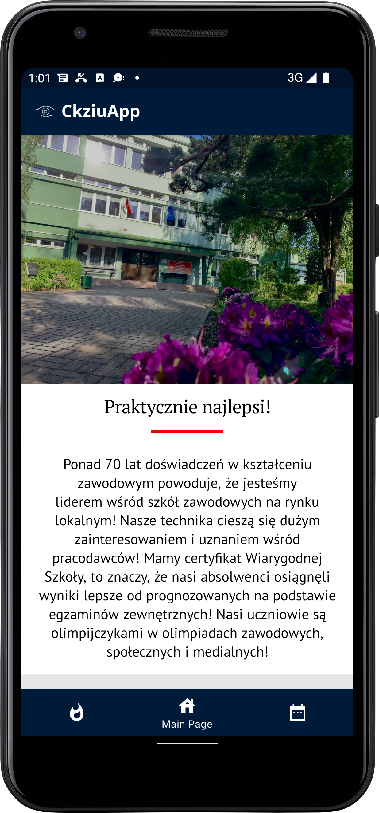
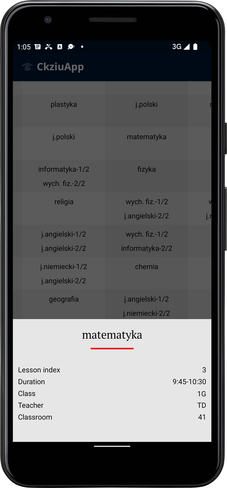
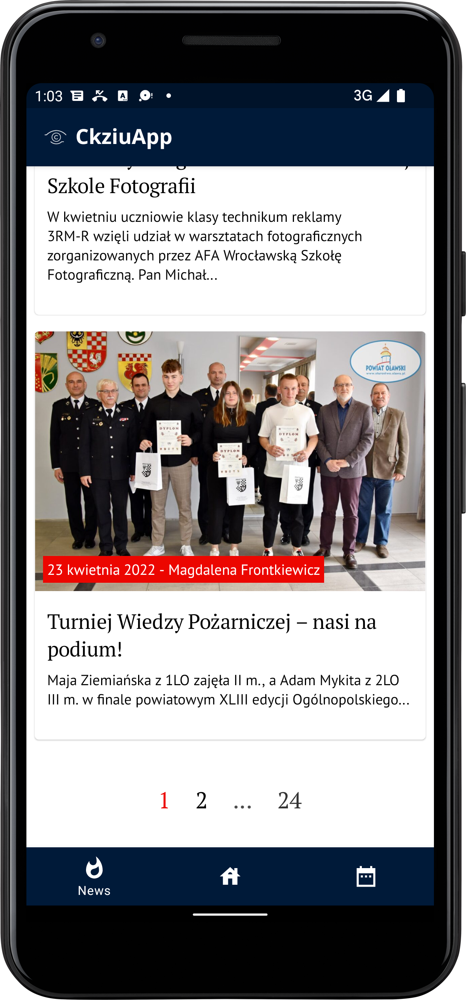

# Ckziu App

App created as a hobby project which was born during boring times of quarantine and develop further.
It's basically a better version of a school's website with extra features.
Main idea was to create an app which will
display lesson schedules in a better way than the original school's site,
but after some time other functionalities were added including
main page and displaying news regarding school.

## Tech Stack
**Main language:** Kotlin

**Multithreading:** Coroutines

**Dependency Injection:** Hilt

**REST:** Retrofit

**Main site:** [link](http://ckziu.olawa.pl/)

## Screenshots

## 🚀 About Me
I'm highly curious and motivated individual interested especially the mobile technologies.
In my free time I really enjoy programming in the Java and Kotlin.

##  Contact

